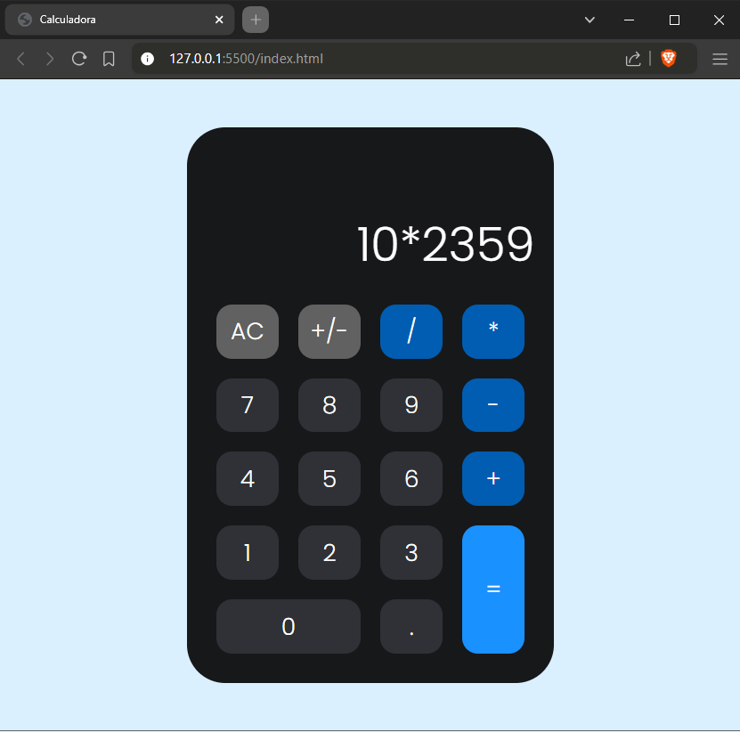

<h1 align="center" style="font-weight: bold;">Calculadora Javascript 💻</h1>

    <b>Realiza cálculos básicos, como adição, subtração, multiplicação, divisão.</b>

<h2 id="layout">🎨 Layout</h2>

    

<h2 id="technologies">💻 Tecnologias</h2>

- HTML
- CSS
- Javascript

<h2 id="started">🚀 Objetivo</h2>

O principal objetivo deste projeto foi aprender a utilizar CSS Grid para criação de layouts, 
além de praticar a manipulação da DOM utilizando JavaScript.

<h2>📫 Como Me Encontrar</h2>

LinkedIn: [Bruna Themoteo](https://www.linkedin.com/in/brunathemoteo/)

Email: dev.brunathemoteo@gmail.com
